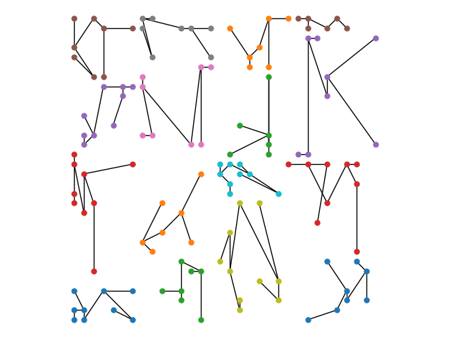
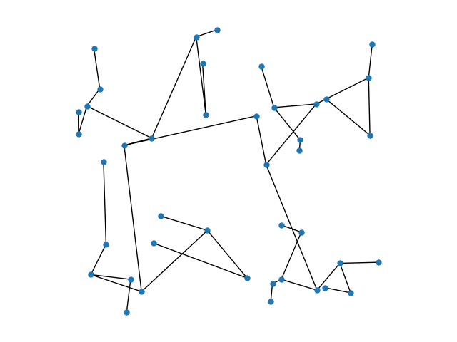

Marco Celoria
# Foundations of HPC: Assignment 2 
## Parallel kd-tree

In the `src` folder, there are several codes in C language designed to build kd-trees.

On ORFEO it is recomended to load the module

`>> module load openmpi-4.1.1+gnu-9.3.0`

before compiling the code.
In general, the Makefile requires a gcc compiler compatible with the most recent standard for the C programming language (ISO/IEC 9899:2018) as we compile with the option -std=c18, together with OpenMP (-fopenmp) and MPI library (mpicc) for the distributed implementations.
Actually, in the `src` folder several versions of the code are present, schematically

```
a) Serial code
b) OpenMP code
c) MPI code simple/approximate implementation (A2A-AllToAll)
d) MPI code definite implementation (P2P-Pointwise exchange)
```

Note that the final steps of the OpenMP and the MPI implementations rely on / need functions of the shared memory code.
Moreover, the MPI implementation (P2P) has two possible versions depending on the role of the fully parallel part of the code: namely whether we 

```
d1) Move / cluster the points among the processes: 
	only the serial part builds the tree out of the clustered points

d2) Store and move / cluster the points:
	both the parallel and the serial parts contribute in building the tree 
```

These two versions are similar in terms of performance, but differ in the relations between the node/points in the final tree.

### Compilation

To compile the code navigate to the `src` directory where there is a Makefile with the following options

```
>> make
>> make debug_points
>> make debug_tree
>> make print
```

where the default `make` simply prints the time it takes to build the tree on std out.
For the other options, see the next Sections.

To select the code (Serial, OpenMP, MPI) set the parameter `code` as

```
>> make [debug_points,debug_tree,print] code=mpi_A2A
>> make [debug_points,debug_tree,print] code=mpi
>> make [debug_points,debug_tree,print] code=openmp
```

The defaul code is the Serial code.

For the MPI case (P2P), one can choose either the Move version or the Store version by specifying

```
>> make [debug_points,debug_tree,print] code=mpi version=store
```

The defaul version is the Move version.

To select the precision of the points, namely float or double type for points, set the parameter

```
>> make [debug_points,debug_tree,print] [code=mpi,openmp,mpi_A2A] precision=double
```

The defaul type is float.

Finally, concerning the points it is possible to either 

```
1) generate N random number in [0,1]x[0,1]

2) load points from file
```
This latter option can be selected with

```
>> make [debug_points,debug_tree,print] [code=mpi,openmp,mpi_A2A] ... data=from_file
```

The file should be like

```
5
1.1 2.1
1.2 2.2
1.3 2.3
1.4 2.4
1.5 2.5
```

i.e. the first number speficies the numer of points to be read and then the list of points with x-coordinate and y-coordinate.

By default, i.e. without specifying any option, data are randomly generated.


### Run the code
To run the code, for the Serial and OpenMP versions just enter

```
>> ./tree_serial.x input
>> ./tree_openmp.x input
```

where `input = filename` if the code was compiled with `data=from_file` otherwise `input` is the number of randomly generated points (`input = 100000000`) etc.

For the MPI versions

```
>> mpirun -np # ./tree_mpi.x input
>> mpirun -np # ./tree_mpi_A2A.x input
```

where # indicates the number of processes and input as before.

#### make debug_points
`make debug_points` prints the starting points and, in the case of the MPI codes, also the distribution of points at the end of the parallel part (or equivalently at the beginning of the serial part) on std out. 

Example:

```
>> make debug_points code=mpi data=from_file
>> mpirun -np 2 ./tree_mpi.x 64_det.input | sort
```

gives

```
MPI kd-tree
Number of points=64
Number of processes=2
[MPI kd tree] Min: 0.001242 Max: 0.001271 Avg: 0.001257
p:[-1](A){0} [1.000, 28.000],
p:[-1](A){0} [1.000, 4.000],
...
p:[-1](A){1} [9.000, 20.000],
p:[-1](A){1} [9.000, 28.000],
......
p:[0](Z){0} [1.000, 2.000],
p:[0](Z){0} [1.000, 28.000],
...
p:[0](Z){1} [31.000, 6.000],
p:[0](Z){1} [32.000, 19.000],
```

where `p` is for point, `[i]` is the level (`[-1]` for the initial points).

`(A)`identifies the initial points, `(Z)` indicates the points at the end of the parallel part.
 
Finally, `{j}` is the rank of the process, `[x,y]` the coordinates of the points.

#### make debug_tree
With `make debug_tree` we print the tree in debug mode on the std output. Example

```
>> make debug_tree code=mpi data=from_file
>> mpirun -np 2 ./tree_mpi.x 64_det.input | sort
```

gives

```
MPI kd-tree
Number of points=64
Number of processes=2
[MPI kd tree] Min: 0.002025 Max: 0.002028 Avg: 0.002026
{1}[0] (10.000,13.000) -> (8.000,31.000) 
{1}[0] (10.000,13.000) -> (9.000,8.000) 
{1}[1] (29.000,17.000) -> (21.000,27.000) 
{1}[1] (29.000,17.000) -> (25.000,1.000)   
...
{2}[0] (8.000,31.000) -> (8.000,25.000)  
...
{3}[0] (1.000,4.000) -> (3.000,6.000) 
...
{4}[0] (12.000,4.000) -> (12.000,3.000)  
...
{5}[0] (1.000,2.000) -> (2.000,1.000)  
...
{6}[0] (2.000,1.000) -> NULL 
...
```

where `{i}` is the level of depth of the node, `[i]` is the rank of the process, `(xp,yp) -> (xc,yc)` the  edge between parent node and child node. For the leaves we have `(xp, yp) -> NULL`

#### make print

Finally, another possibility is `make print` that is supposed to be used together with the python code `show_kdtree.py` which requires the following modules

```
from treelib import Node, Tree
import networkx as nx
```

The procedure is the following:

For example, consider the mpi moving code with single precision points loaded from file


```
>> make print code=mpi data=from_file
>> mpirun -np 16 ./tree_mpi.x 128_det.input | sort > ../example16.dat
```

Note the `| sort` is essential for the python code to work properly.

This produces a file called `example16.dat` with 

```
A) SIZE= 16
B) 0   4 P0_2.000000_1.000000 2.000000 1.000000
...
C) 0   4 P0_2.000000_1.000000 2.000000 1.000000
...
D) 0   4 P0_2.000000_1.000000 P0_2.000000_2.000000
...
Loadind data from file: 128_det.input
MPI kd-tree
[MPI kd tree] Min: 0.000878 Max: 0.001042 Avg: 0.000985
Number of points=128
Number of processes=16
```

Then, consider the python code

```
>> python show_kdtree.py example16.dat img/example16.png > data_results/example16.out
```

which produces the following files:

-) `example16.png ` 



Here we have a visualization of the distributed tree among the 16 processes (each process corresponds to a different color, but we have only 10 different colors, so some colors are repeated).

-) `example16.out`

```
input file: example16.dat
output file: img/example16.png
Tree:

(2.000000, 1.000000)
├── (2.0, 2.0)
│   ├── (1.0, 2.0)
│   │   └── (1.0, 1.0)
│   └── (1.0, 4.0)
└── (4.0, 4.0)
    ├── (7.0, 1.0)
    │   └── (5.0, 2.0)
    └── (7.0, 4.0)

(2.000000, 12.000000)
├── (1.0, 17.0)
│   ├── (1.0, 14.0)
│   │   └── (1.0, 13.0)
│   └── (1.0, 18.0)
└── (2.0, 16.0)
    ├── (3.0, 13.0)
    │   └── (3.0, 6.0)
    └── (7.0, 17.0)

(12.000000, 7.000000)
├── (12.0, 4.0)
│   ├── (10.0, 4.0)
│   └── (12.0, 3.0)
└── (14.0, 6.0)
    ├── (13.0, 6.0)
    └── (14.0, 1.0)

(10.000000, 10.000000)
├── (12.0, 12.0)
│   ├── (13.0, 9.0)
│   └── (14.0, 16.0)
└── (8.0, 9.0)
    ├── (10.0, 13.0)
    └── (9.0, 8.0)

(4.000000, 25.000000)
├── (3.0, 20.0)
│   ├── (2.0, 19.0)
│   │   └── (2.0, 20.0)
│   └── (2.0, 22.0)
└── (6.0, 25.0)
    ├── (6.0, 24.0)
    │   └── (5.0, 21.0)
    └── (7.0, 25.0)

(3.000000, 32.000000)
├── (1.0, 29.0)
│   ├── (1.0, 32.0)
│   └── (3.0, 26.0)
│       └── (1.0, 28.0)
└── (4.0, 31.0)
    ├── (4.0, 26.0)
    └── (7.0, 31.0)

(13.000000, 19.000000)
├── (14.0, 27.0)
│   ├── (14.0, 19.0)
│   └── (15.0, 27.0)
└── (8.0, 25.0)
    ├── (8.0, 26.0)
    └── (9.0, 20.0)
        └── (8.0, 20.0)

(12.000000, 31.000000)
├── (13.0, 31.0)
│   ├── (15.0, 28.0)
│   └── (15.0, 31.0)
└── (8.0, 32.0)
    ├── (9.0, 28.0)
    │   └── (8.0, 31.0)
    └── (9.0, 32.0)

(18.000000, 13.000000)
├── (17.0, 6.0)
│   ├── (17.0, 10.0)
│   │   └── (16.0, 7.0)
│   └── (18.0, 2.0)
│       └── (18.0, 3.0)
└── (22.0, 5.0)
    ├── (20.0, 13.0)
    └── (22.0, 3.0)
        └── (20.0, 5.0)

(17.000000, 17.000000)
├── (16.0, 16.0)
│   ├── (16.0, 17.0)
│   └── (17.0, 15.0)
│       └── (17.0, 14.0)
└── (19.0, 16.0)
    ├── (18.0, 17.0)
    └── (22.0, 14.0)
        └── (18.0, 16.0)

(29.000000, 3.000000)
├── (29.0, 4.0)
│   ├── (27.0, 7.0)
│   └── (28.0, 2.0)
│       └── (25.0, 1.0)
└── (31.0, 6.0)
    ├── (30.0, 7.0)
    └── (31.0, 3.0)

(27.000000, 13.000000)
├── (25.0, 17.0)
│   ├── (23.0, 17.0)
│   └── (27.0, 17.0)
│       └── (26.0, 11.0)
└── (29.0, 17.0)
    ├── (30.0, 15.0)
    │   └── (30.0, 8.0)
    └── (30.0, 17.0)

(21.000000, 19.000000)
├── (21.0, 20.0)
│   ├── (17.0, 18.0)
│   └── (18.0, 21.0)
└── (21.0, 26.0)
    └── (21.0, 18.0)

(20.000000, 29.000000)
├── (19.0, 28.0)
│   ├── (17.0, 31.0)
│   └── (19.0, 27.0)
└── (21.0, 32.0)
    ├── (21.0, 27.0)
    └── (23.0, 32.0)

(27.000000, 24.000000)
├── (25.0, 30.0)
│   ├── (25.0, 18.0)
│   │   └── (24.0, 18.0)
│   └── (26.0, 30.0)
└── (27.0, 26.0)
    ├── (32.0, 19.0)
    └── (32.0, 30.0)

(27.000000, 31.000000)
├── (25.0, 32.0)
│   ├── (24.0, 32.0)
│   └── (25.0, 31.0)
└── (28.0, 32.0)
    └── (29.0, 31.0)
```

We tested the code up to 10000 random points homogeneously distributed in [0,1]x[0,1], but keep in mind that `this printing code is just for illustrative purposes`.

As another example, consider the OpenMP code with 42 double precision, randomly generated points in [0,1]x[0,1]

```
>> make print code=openmp precision=double
>> ./tree_openmp.x 42 | sort > ../example42.dat 
```
and then

```
python show_kdtree.py example42.dat img/example42.png > data_results/example42.out
```

The resulting files are

-) `example42.png`




-) `example42.out`

```
input file: example42.dat
output file: img/example42.png
Tree:

(0.587542, 0.650684)
├── (0.156713, 0.554679)
│   ├── (0.213397, 0.077463)
│   │   ├── (0.048427, 0.132792)
│   │   │   ├── (0.097868, 0.232259)
│   │   │   │   └── (0.089628, 0.501847)
│   │   │   └── (0.177929, 0.117359)
│   │   │       └── (0.164828, 0.009853)
│   │   └── (0.427886, 0.276975)
│   │       ├── (0.275322, 0.323942)
│   │       └── (0.557276, 0.121605)
│   │           └── (0.252553, 0.235644)
│   └── (0.246449, 0.578049)
│       ├── (0.035506, 0.682807)
│       │   ├── (0.008272, 0.590803)
│       │   │   └── (0.007602, 0.664435)
│       │   └── (0.077617, 0.739122)
│       │       └── (0.05853, 0.870114)
│       └── (0.391337, 0.90869)
│           ├── (0.42289, 0.65564)
│           │   └── (0.41205, 0.821897)
│           └── (0.459975, 0.931976)
└── (0.619184, 0.491808)
    ├── (0.782275, 0.689574)
    │   ├── (0.644935, 0.678021)
    │   │   ├── (0.603326, 0.811748)
    │   │   └── (0.730112, 0.572275)
    │   │       └── (0.727767, 0.539066)
    │   └── (0.952861, 0.775348)
    │       ├── (0.95707, 0.587625)
    │       │   └── (0.814868, 0.705392)
    │       └── (0.96463, 0.885572)
    └── (0.785001, 0.082062)
        ├── (0.668655, 0.117204)
        │   ├── (0.639838, 0.103373)
        │   │   └── (0.634085, 0.044581)
        │   └── (0.733725, 0.27132)
        │       └── (0.669618, 0.294014)
        └── (0.859071, 0.169913)
            ├── (0.894432, 0.073552)
            │   └── (0.809515, 0.09054)
            └── (0.985698, 0.173099)

```

